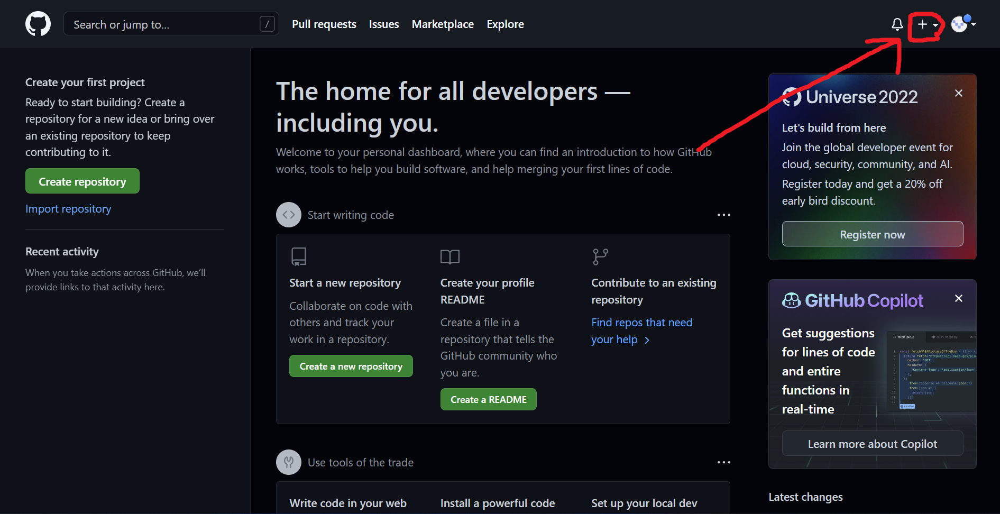

<p align="center">
  <a href="https://www.gatsbyjs.com/?utm_source=starter&utm_medium=readme&utm_campaign=minimal-starter">
    
  </a>
</p>
<h1 align="center">
  WDC JAMStack Template
</h1>

<p align="center">Have questions? <a href="mailto:jagarapua24@columbusacademy.org,jacksons24@columbusacademy.org">Email us</a>.<p>

<p align="center">This is a quick template for making a website. Out of the box, it's fast, efficient, and secure. You can follow these steps and links or attend our club meetings to learn more.</p>

<hr />

## 🚀 Quick start

### 1. Set up your computer (first time only).

- <h4 id="schoolLaptop">School Laptop</h4>

  1. Go to https://github.com/columbusacademy/wdc-jamplate.

  2. Press the green <code>Code⏷</code> button.

  

  3. Select <code>Download ZIP</code> and press <kbd>Enter</kbd>.

  

  4. Drag the downloaded file to your Desktop and double-click it.

  5. Open spotlight ( <kbd>⌘</kbd> + <kbd>Space</kbd> ), type <code>terminal</code>, and press <kbd>Enter</kbd>.

  6. Click inside the newly opened window.

  7. Type <code>cd Desktop/wdc-jamplate</code> and press <kbd>Enter</kbd>.

  8. Type <code>chmod 755 ./setup.sh && ./setup.sh</code> and press <kbd>Enter</kbd>.

  9. Next: [Start Developing](#sd)

- #### Personal Computer

  [See below.](#personalComputer)

### 2. <span id="sd">Start developing.</span>

1.  Open VS Code.

2.  Type <kbd>⌘</kbd> + <kbd>O</kbd> (MacOS) or <kbd>Ctrl</kbd> + <kbd>O</kbd> (Windows)

3.  Find the <code>wdc-jamplate</code> folder, click on it, and press <kbd>Enter</kbd>.

4.  Open the terminal and enter <code>npm t</code>.

### 3. Open the code and start customizing!

Your site is now running at http://localhost:8000!

(Please tell me your default browser is Chrome.)

Edit `src/pages/index.js` to see your site update in real-time!

### 4. Learn more

- [Documentation](https://www.gatsbyjs.com/docs/?utm_source=starter&utm_medium=readme&utm_campaign=minimal-starter) (General link)

- [Tutorials](https://www.gatsbyjs.com/tutorial/?utm_source=starter&utm_medium=readme&utm_campaign=minimal-starter) (Beginners)

- [Guides](https://www.gatsbyjs.com/tutorial/?utm_source=starter&utm_medium=readme&utm_campaign=minimal-starter) (Specific examples)

- [API Reference](https://www.gatsbyjs.com/docs/api-reference/?utm_source=starter&utm_medium=readme&utm_campaign=minimal-starter) (Advanced)

- [Plugin Library](https://www.gatsbyjs.com/plugins?utm_source=starter&utm_medium=readme&utm_campaign=minimal-starter) (Browse Plugins)

- [Cheat Sheet](https://www.gatsbyjs.com/docs/cheat-sheet/?utm_source=starter&utm_medium=readme&utm_campaign=minimal-starter) (Handy)

<hr />

## 🚀 To the internet! (Gatsby Cloud)

Deploy this website with one click on [Gatsby Cloud](https://www.gatsbyjs.com/cloud/):

1. WORK IN PROGRESS

2. "

3. [Create an account](https://www.gatsbyjs.com/dashboard/signup/) on Gatsby Cloud

<hr />

## <span id="personalComputer">Personal Computer Setup</span>

### MacOS

- [**Download VS Code**](https://code.visualstudio.com/)

- **Download Git**

  1.  Open spotlight ( <kbd>⌘</kbd> + <kbd>Space</kbd> ), type <code>terminal</code>, and press <kbd>Enter</kbd>.

  2.  Click inside the newly opened window.

  3.  Type <code>git</code> and press <kbd>Enter</kbd>.

  4.  Follow the prompts to compete the installation.

- **Go to the [School Laptop](#schoolLaptop) setup.**

### Windows

- [**Download VS Code**](https://code.visualstudio.com/)

- [**Download Git**](https://git-scm.com/download/win)

- [**Download NVS**](https://github.com/jasongin/nvs/releases)

  1. Click on <code>nvs-x.x.x.msi</code> (the x's will be numbers) and press <kbd>Enter</kbd>.

  

  2. Open the file and follow the prompts to complete the installation.

- **Set up Everything Else**

  1. Go to https://github.com/columbusacademy/wdc-jamplate.

  2. Press the green <code>Code⏷</code> button.

  

  3. Select <code>Download ZIP</code> and press <kbd>Enter</kbd>.

     

  4. Drag the downloaded file to your Desktop, double-click it, and press <kbd>Enter</kbd>.

  5. Open search ( <kbd>Windows</kbd> + <kbd>S</kbd> ), type <code>terminal</code>, and press <kbd>Enter</kbd>.

  6. Click inside the newly opened window.

  7. Type the following, pressing <kbd>Enter</kbd> after each line.

     ```shell
         cd OneDrive/Desktop/wdc-jamplate
         nvs add lts
         nvs use lts
         nvs link lts
         npm i -g npm npm-check-updates gatsby-cli
         npm i
         echo "\n\nYou're welcome ;)"
     ```

  8. Next: [Start Developing](#sd)

### Linux

Don't worry. We still love you.

Just [email us](mailto:jagarapua24@columbusacademy.org,jacksons24@columbusacademy.org) to set up an in-person or zoom meeting.

<hr />

## Remember: Ask Questions!

If you have any questions or interesting ideas, we're here to help. [Email us](mailto:jagarapua24@columbusacademy.org,jacksons24@columbusacademy.org) and set up an in-person or zoom meeting.
