<p align="center">
  <a href="https://www.gatsbyjs.com/?utm_source=starter&utm_medium=readme&utm_campaign=minimal-starter">
    
  </a>
</p>
<h1 align="center">
  WDC Website Template
</h1>

<p align="center">Have questions? <a href="mailto:jagarapua24@columbusacademy.org,jacksons24@columbusacademy.org">Email us</a>.<p>

<p align="center">This is a quick template for making a website. Out of the box, it's fast, efficient, and secure. You can follow these steps and links or attend our club meetings to learn more.</p>

<hr />

## 🗺️ Table of Contents

1. ### [Quick start](#🚀-quick-start)

   a. [**Set up your computer (first time only)**](#a-set-up-your-computer-first-time-only)

   - [School laptop](#school-laptop)
   - [Personal Computer](#personal-computer)

   b. [**Start customizing**](#b-open-the-code-and-start-customizing)

   c. [**Learn more**](#c-learn-more)

2. ### [To the Internet!](#🚀-to-the-internet)

   a. [**Login to GitHub**]()

   b. [**Initialize a repository**]()

   c. [**Login to Gatsby Cloud**]()

   d. [**Launch your website**]()

3. ### [Personal Computer Setup](#personal-computer-setup)

   - [**MacOS**](#macos)

   - [**Windows**](#windows)

   - [**Linux**](#linux)

4. ### [Remember: Ask questions!](#remember-ask-questions)

<hr />

## 🚀 Quick start

### a. Set up your computer (first time only)

- #### School Laptop

  i. Log in to [GitHub](https://github.com/signup).

  ii. Press the <code>+</code> button on the top-right corner.

  

  iii. Select <kbd>New repository</kbd>.

  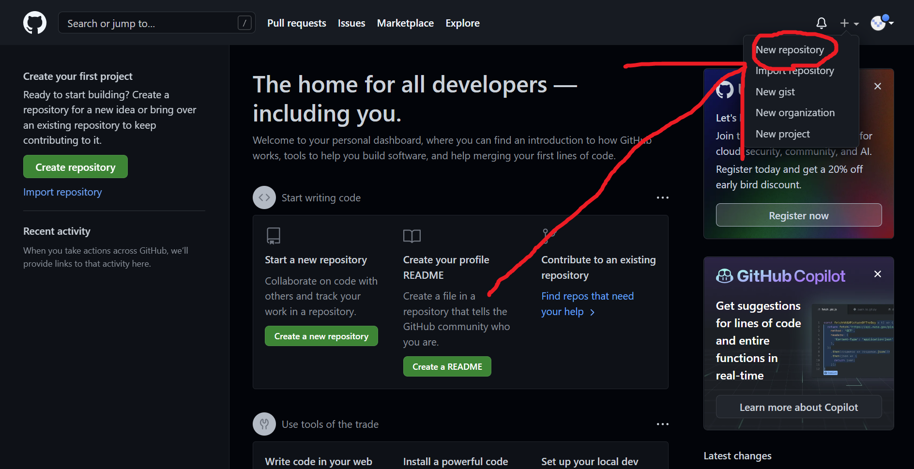

  iv. Click this textbox, type your project's name, and press <kbd>Enter</kbd>.

  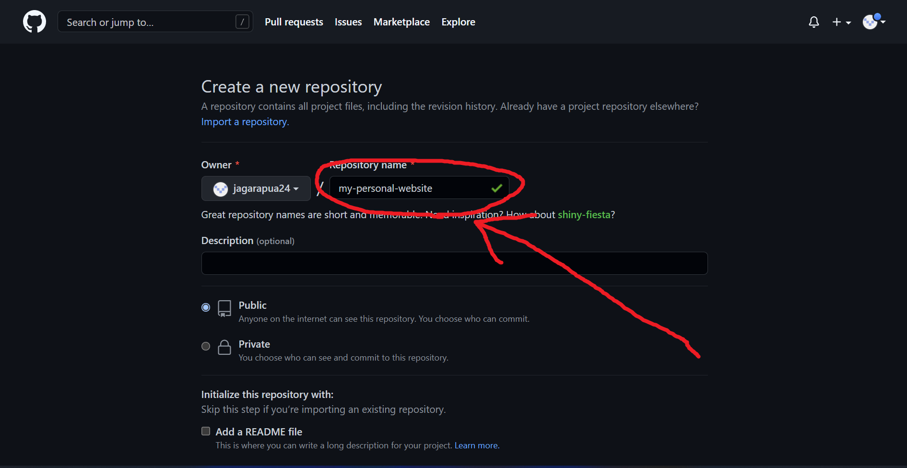

  v. Press the copy button on the right side of the screen.

  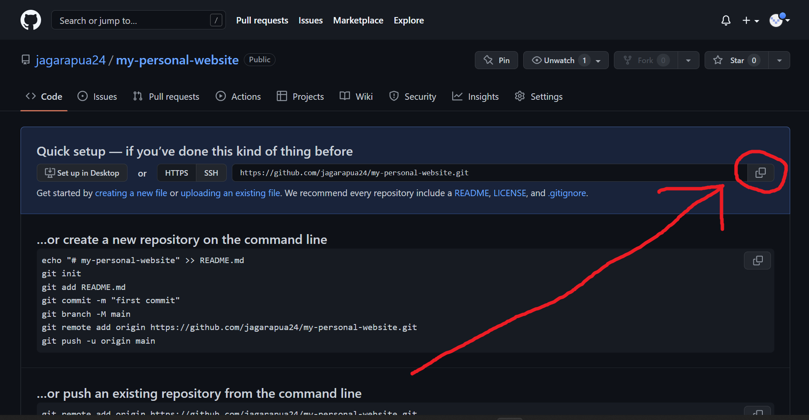

  vi. Open Visual Studio Code.

  vii. Press this button on the left.

  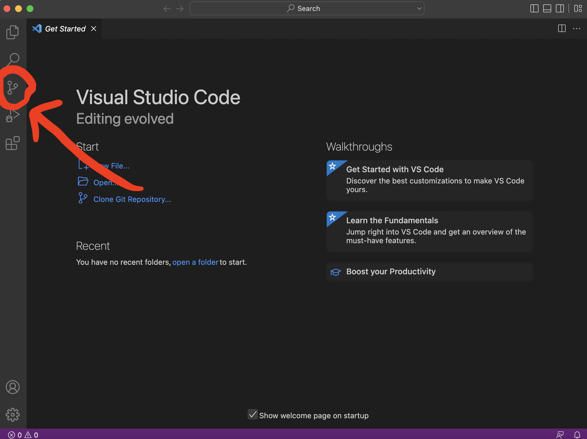

  viii. Select <kbd>Clone Repository</kbd> and press <kbd>Enter</kbd> until your browser opens.

  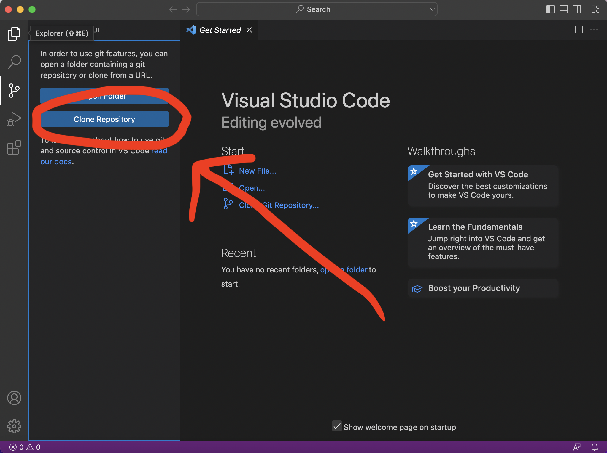

  ix. Enter your GitHub username and password again and press <kbd>Enter</kbd> until you see the <code>Repository name</code> search menu.

  x. In the search menu, type <code>columbusacademy/wdc-jamplate</code>, and press <kbd>Enter</kbd>.

  xi. The file explorer should open. Click the Desktop folder and press <kbd>Enter</kbd>.

  xii. On the bottom right, click <kbd>Open</kbd>.

  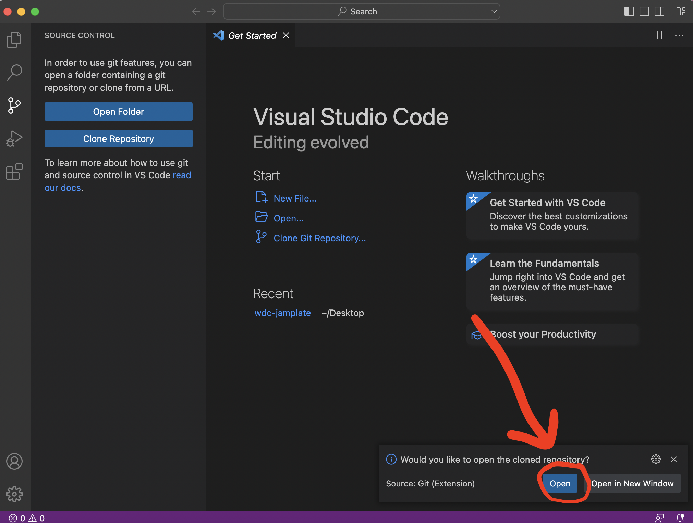

  xiii. Select <kbd>Yes, I trust the authors</kbd>.

  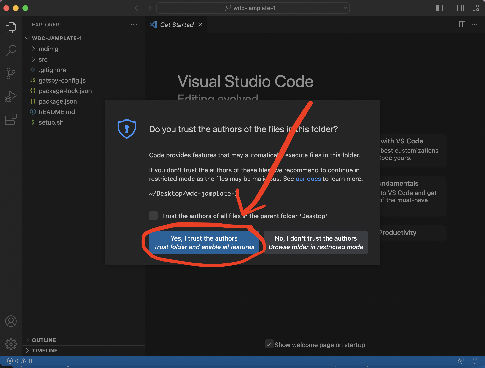

  xiv. Press this button on the left.

  

  xv.

  xix. Open the terminal.

  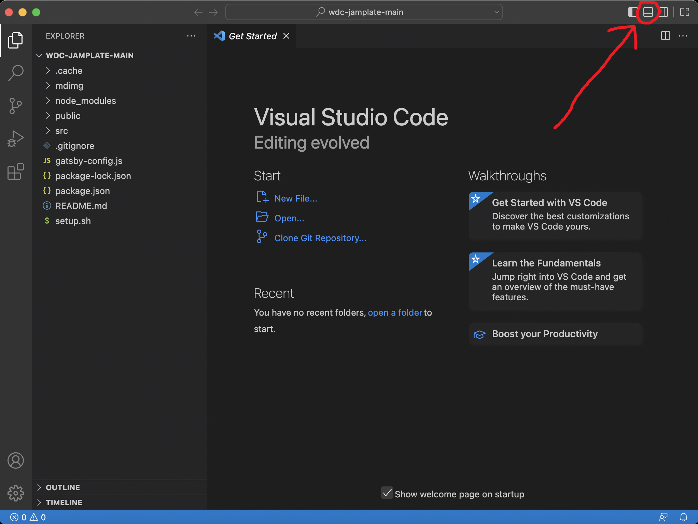

  xv. Type <code>chmod 755 setup.sh && ./setup.sh</code> and press <kbd>Enter</kbd>.

  That's it!

  Next: [Open the code and start customizing!](#2-start-developing)

- #### Personal Computer

  [See below.](#personal-computer-setup)

### b. Open the code and start customizing!

1. Open your project folder in VS Code (done in the previous section)

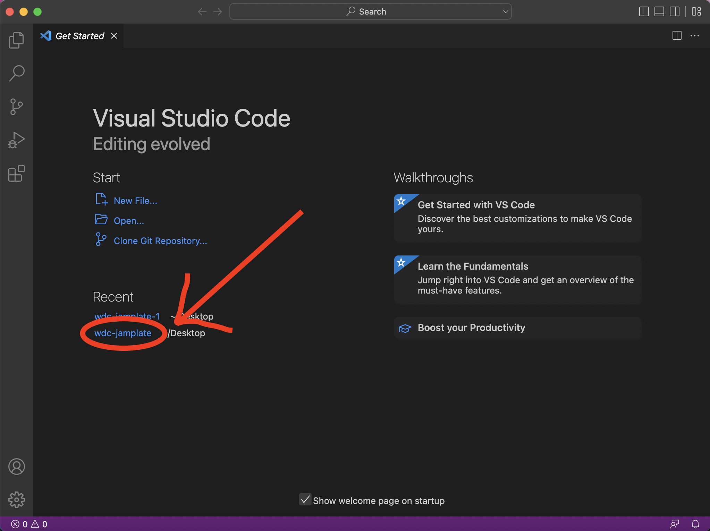

2. Open the terminal.


3. Type <code>npm t</code> and press <kbd>Enter</kbd>.

Your site is now running at http://localhost:8000!

(Please tell me your default browser is Chrome.)

Edit `src/pages/index.js` to see your site update in real-time!

### c. Learn more

- [Documentation](https://www.gatsbyjs.com/docs/?utm_source=starter&utm_medium=readme&utm_campaign=minimal-starter) (General link)

- [Tutorials](https://www.gatsbyjs.com/tutorial/?utm_source=starter&utm_medium=readme&utm_campaign=minimal-starter) (Beginners)

- [Guides](https://www.gatsbyjs.com/tutorial/?utm_source=starter&utm_medium=readme&utm_campaign=minimal-starter) (Specific examples)

- [API Reference](https://www.gatsbyjs.com/docs/api-reference/?utm_source=starter&utm_medium=readme&utm_campaign=minimal-starter) (Advanced)

- [Plugin Library](https://www.gatsbyjs.com/plugins?utm_source=starter&utm_medium=readme&utm_campaign=minimal-starter) (Browse Plugins)

- [Cheat Sheet](https://www.gatsbyjs.com/docs/cheat-sheet/?utm_source=starter&utm_medium=readme&utm_campaign=minimal-starter) (Handy)

<hr />

## 🚀 To the internet!

Deploy this website with one click on [Gatsby Cloud](https://www.gatsbyjs.com/cloud/):

1. [Create an account](https://www.gatsbyjs.com/dashboard/signup/) on Gatsby Cloud.

2. Select <kbd>Authorize Gatsby Cloud</kbd>.


3. Click <kbd>Add a site +</kbd>.

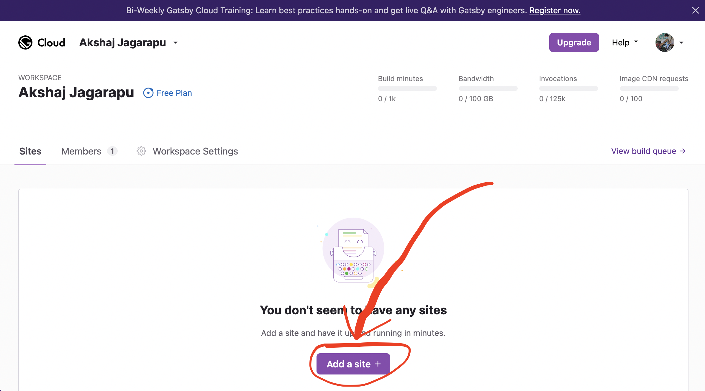

4. Select <kbd>GitHub</kbd>.

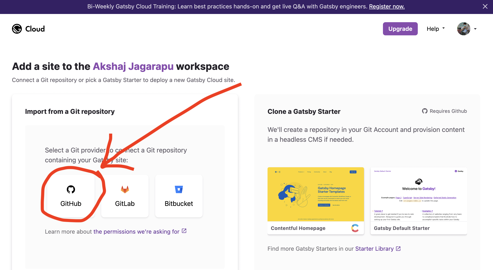

5. Select <kbd>Click here to add an installation</kbd>.

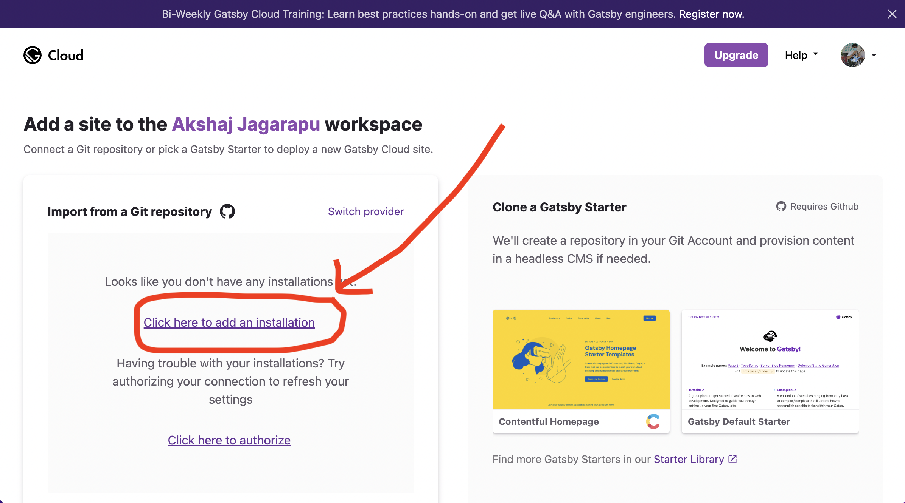

5. In the pop-up window, scroll down and click <kbd>Install</kbd>.

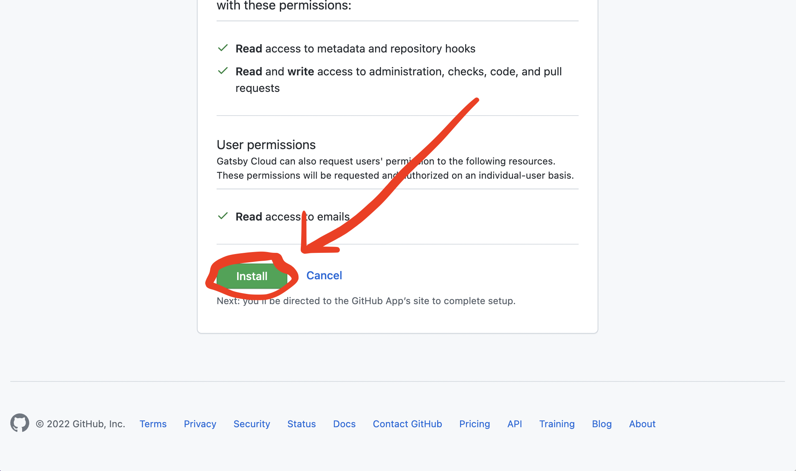

6. The pop-up window should close. Find your project's name and click <kbd>Import</kbd> next to it.

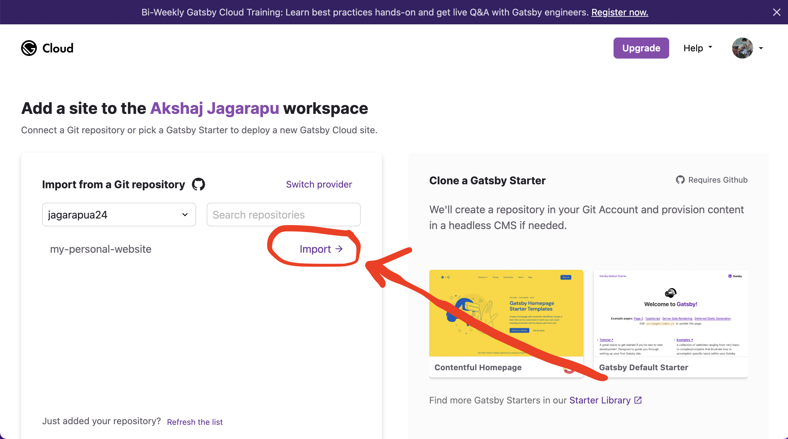

<hr />

## 💻 Personal Computer Setup

### MacOS

- [**Download Visual Studio Code**](https://code.visualstudio.com/)

- **Download Git**

  1.  Open spotlight ( <kbd>⌘</kbd> + <kbd>Space</kbd> ), type <code>terminal</code>, and press <kbd>Enter</kbd>.

  2.  Click inside the newly opened window.

  3.  Type <code>git</code> and press <kbd>Enter</kbd>.

  4.  Follow the prompts to compete the installation.

- **Go to the [School Laptop](#school-laptop) setup.**

### Windows

- [**Download Visual Studio Code**](https://code.visualstudio.com/)

- [**Download Git**](https://git-scm.com/download/win)

- [**Download NVS**](https://github.com/jasongin/nvs/releases)

  1. Click on <code>nvs-x.x.x.msi</code> (the x's will be numbers) and press <kbd>Enter</kbd>.

  

  2. Open the file and follow the prompts to complete the installation.

- **Set up everything else**

  1. Follow the [School Laptop](#school-laptop) instructions up to **xiv**.

  2. Type the following, pressing <kbd>Enter</kbd> after each line.

     ```bash
         cd OneDrive/Desktop/wdc-jamplate-main
         nvs add lts
         nvs use lts
         nvs link lts
         npm i -g npm npm-check-updates gatsby-cli
         npm i
         echo "\n\nYou're welcome ;)\n"
     ```

  3. Next: [Open the code and start customizing!](#b-open-the-code-and-start-customizing)

### Linux

Don't worry. We still love you.

Just [email us](mailto:jagarapua24@columbusacademy.org,jacksons24@columbusacademy.org) to set up an in-person or zoom meeting.

<hr />

## 👑 Remember: Ask questions!

If you have any questions or interesting ideas, we're here to help. [Email us](mailto:jagarapua24@columbusacademy.org,jacksons24@columbusacademy.org) and set up an in-person or zoom meeting.
